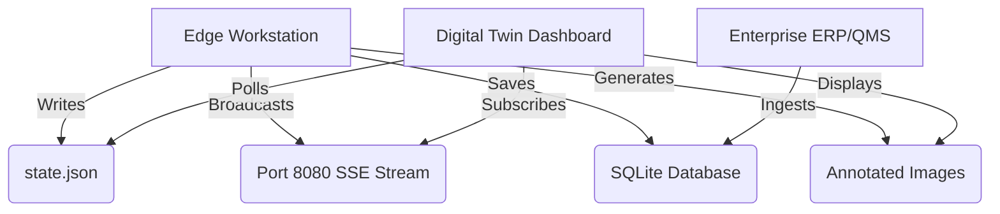

# Digital Twin Architecture & Telemetry

This component details the data architecture designed to bridge the gap between offline-first edge manufacturing stations and enterprise-level real-time monitoring platforms.

## Overview

A "Digital Twin" requires near-instantaneous reflection of the physical world in a digital interface. To achieve this in a manufacturing environment without bogging down the factory network or compromising the edge device's performance, we implemented a dual-stream architecture: a lightweight `state.json` file for static snapshots and an HTTP Event Bridge (Server-Sent Events) for real-time push notifications.

## Key Architectural Components

### 1. The Master State File (`state.json`)
At any given moment, the entire operational state of the workstation is serialized into a local JSON file. 
- **Purpose:** Acts as the single source of truth for the edge device. 
- **Content:** Contains current machine status (Running, Fault, Idle), current operator ID, active Work Order / Part Number, cycle times, and the result of the last inspection.
- **Integration:** Third-party Digital Twin platforms (e.g., ThingWorx, Ignition, PowerBI) can be configured to poll this file via the local network. Because it is a simple text file, it requires virtually zero overhead to parse.

### 2. Real-Time Event Stream (Port 8080)
For platforms that support push notifications, polling a file is inefficient. We built a local, lightweight HTTP server that broadcasts Server-Sent Events (SSE).
- **Purpose:** Instantaneous telemetry.
- **Mechanism:** The application opens an HTTP endpoint (e.g., `http://[DEVICE_IP]:8080/stream`). 
- **Integration:** A Digital Twin dashboard or a network PLC can subscribe to this stream. The exact millisecond a part passes or fails inspection, an event is pushed across the network, triggering visual updates on remote screens instantly.

### 3. Historical Traceability & Reporting
While real-time data is critical for monitoring, historical data is necessary for root-cause analysis and compliance.
- **SQLite Database:** Every event is logged locally.
- **Automated Exports:** Upon completion of a Work Order, the system automatically generates comprehensive CSV reports and saves them to an `Exports/` directory, which is synced to a protected network drive.

### 4. Visual Evidence Routing
For inspection systems (like the Angle Detection system), raw numbers aren't always enough.
- **Overlays:** The system saves annotated images (with drawn measurement lines and bounding boxes) to an `images/overlay/` directory.
- **Dashboard Linking:** The Digital Twin dashboard references the latest image in this directory, allowing supervisors sitting in an office to physically "see" the exact component that was just inspected on the line.

## Architecture Diagram (Abstracted)

